# The Lane Emden Chandrasekhar Equation
The Lane Emden Chandrasekhar Equation was found in 1869 by astrophysicists Jonathan Homer Lane and Robert Emden. It is of enormous applications in field of astrophysics. It is essentially a mixture of various equations combined to give a single equation whose solutions help us derive all important parameters involved to understand the dynamics of a star. To understand this needs elementary knowledge and bit of numerical solving of differential equations. I use Mathematica to solve this equation. My aim is to understand this equation. 

For a non-physics student, viewing this README page will help in following manner-
1. How do we create a model by cumulating many "very basic ideas" in physics. We must start from something right?
2. Develop a kind of smartness which is to combine many equations into one simple equation. 
3. Techniques to solving non-linear differential equations numerically.  
4. This concept is considered basic in all astrophysics courses, curious readers can deep dive. 

We will derive the Lane Emden Equation, and in that manner get to know the assumptions as well as between the lines implications. We will together explore the solutions for general n. <!-- We deal more with the overall picture rather than the plots involved in this, so it is better to ignore the tiny details in each graph unless specified. This kind of idea is ubiquitous to all fields.--> Once equipped with all the knowledge we need, we will together rediscover all the parameter values for our sun sitting at the center of our solar system.

<!--  This equation can be a salad of symbols. So take your sweet time with it. -->

<!--Whatever is stated in this webpage is checked multiple times and 100% legit information. Even then, there are possibilities of mistake is being made, so please mention on my [email](mailto:omshah0405@gmail.com) so that I can rectify them.-->
Possibile corrections can be mailed to me at my [email](mailto:omshah0405@gmail.com).

Let us begin understanding the Lane Emden Chandrasekhar Equation.

The gravitational Gauss law states that $\textit{The gravitational flux through any closed surface is proportional to the enclosed mass.}$
Differential form is $\vec{\nabla}\cdot \vec{g} = - 4 \pi G \rho$.
Integral form is $\iint \vec{g}\cdot \vec{\mathrm{d}A} =-4 \pi G M_{enc}$.

Suppose in an empty space I add a source. A source is a aggregate body of mass localised in a finite volume. Newton tells us the source will create a gravitational potential field around the source $\displaystyle \propto -\frac{1}{r}$. This is considered a **_conservative field_**, that itself creates a force field around the source given by $\vec{F}=-\nabla V$. The force field is also given by $\vec{F}=m\vec{g}=\vec{g}$, (assume m=1).

Substitute in gauss law, $\vec{g}=-\nabla V$ becomes $\vec{\nabla} \cdot -\nabla V = - 4 \pi G \rho$, or $\nabla^{2} V = 4 \pi G \rho$ which is the poisson's equation of gravitational gauss law.

The Laplacian of f(x,y) is divergence of a gradient of f(x,y). The gradient of f(x,y) indicates the steepest path to reach uphill in the curve. The divergence of any curve shows how the fluid will flow in that small region. The laplacian shows curvature. That means the laplacian will display convergence (laplacian is -ve valued) at maxima and (laplacian is +ve valued) divergence at minima. At maxima, the second derivative is negative and at minima, is positive. <!--Thus laplacian of any curve can be understood by behavior of its second derivative. -->

Now, suppose the shape of the massive object in 3 dimensional space is **_spherically symmetric_**. The polar angle and azimuthal angle components are a constant. We primarily consider the density profile of the object given by 
$\rho = \rho (r)$.
The density profile is strictly related to radial distance. The mass profile of the object is given by
① $\mathrm{d}M= \int \rho \mathrm{d}V$. 
We can state that potential field $V=V(r)$ created due to presence of mass is also strictly related to radial distance because of gravitational field $\vec{g} = \vec{g} (r)$. 

So the Laplacian of V can be rewritten as, 
② $\nabla^{2} V = \frac{1}{r^2}\frac{\partial}{\partial r}\big( r^2 \frac{\partial V}{\partial r}\big)  = 4 \pi G \rho(r)$.

<!-- ⑦ ⑧ ⑨ ⑩ -->

Let suppose body is a **_star_** and it is in **_hydrostatic equilibrium_**, this means that the star at each point is in _inertial equilibrium_ (_assumes perfect balance_) between the two forces: 1. star expansion due to nuclear reaction, 2. contraction due to increase in gravitational field as nuclear reactions happen, mass is increased in endproduct resulting in increased gravitational field. The equation is given by $F = \frac{\mathrm{d}P}{\mathrm{d}r}\mathrm{d}r\mathrm{d}A = -\frac{G M(r) \rho (r)}{r^2}\mathrm{d}r\mathrm{d}A$.

On simplification, this equation becomes, 
③ $\frac{\mathrm{d}P}{\mathrm{d}r} = -\frac{G M(r) \rho (r)}{r^2}$.

$\vec{F}=-\nabla V$ and $F=\frac{G M(r)}{r^{2}}$ allows us to rewrite the hydrostatic equilibrium equation as 
$\frac{\partial V}{\partial r} = - \frac{1}{\rho} \frac{\partial P}{\partial r}$.

Therefore, one can write the Laplacian of $V$ (Eq.②) as simple combination of mass profile equation and hydrostatic equilibrium.  

Now we use the **_ideal gas polytropic equation_** which states that for any polytropic index $n$, the ideal gas equation is 
$P V^{1+\frac{1}{n}}=\text{constant}$.
$V = \frac{M}{\rho}$ implies that 
④ $P =K \rho^{1+\frac{1}{n}}$ where $K$ is a dimensional constant. 
This equation can be understood by understanding $n$, that is when $n=0$ process is isothermal, $n=\frac{1}{\gamma-1}$ process is adiabatic. 

Here we introduce a **_parametrization of density profile_** of the form 
⑤ $\rho(r) = \rho_{c} \theta(r)^{n}$ where $\rho_{c}$ is the central density, $n$ is the polytropic index of ideal gas equation and $\theta(r)$ is a dimensionless variable, which we are interested in. Density at any point can be related to the central density by this new function. The essence of this equation lies in $n$, which connects the density profile to polytropic ideal gas equation. 

Introducing ④ and ⑤ to the laplacian of $V$ we do the following steps to achieve the Lane Emden equation. 

$\frac{1}{r^2}\frac{\partial}{\partial r}\big( \frac{r^2}{\rho} \frac{\partial P}{\partial r}\big)  = -4 \pi G \rho(r)$

$P = K\rho_c^{1+\frac{1}{n}}\theta^{n+1}$

First compute the pressure derivative

$\frac{\partial P}{\partial r} = K\rho_c^{1+\frac{1}{n}}(n+1)\theta^n \frac{\partial\theta}{\partial r}$

Now divide by $\rho$

$\frac{1}{\rho}\frac{\partial P}{\partial r}=\frac{K\rho_c^{1+\frac{1}{n}}(n+1)\theta^n}{\rho_c\theta^n}\frac{\partial\theta}{\partial r}=K(n+1)\rho_c^{\frac{1}{n}}\frac{\partial\theta}{\partial r}$

Substitute into the main equation

$\frac{1}{r^2}\frac{\partial}{\partial r}\left(r^2 K(n+1)\rho_c^{\frac{1}{n}}\frac{\partial\theta}{\partial r}\right)=-4\pi G\rho_c\theta^n$

Since the constant factors can be taken outside,

$K(n+1)\rho_c^{\frac{1}{n}}\frac{1}{r^2}\frac{\partial}{\partial r}\left(r^2\frac{\partial\theta}{\partial r}\right)=-4\pi G\rho_c\theta^n$

Divide by $K(n+1)\rho_c^{1/n}$

$\frac{1}{r^2}\frac{\partial}{\partial r}\left(r^2\frac{\partial\theta}{\partial r}\right)=-\frac{4\pi G\rho_c}{K(n+1)\rho_c^{1/n}}\theta^n$

**_Introduce the dimensionless variable_** $\xi$ such that

⑥ $r = a \xi$

where
$a^2 =\frac{(n+1)K\rho_c^{\frac{1}{n}-1}}{4\pi G}$. Note that $[a]=[L]$ so $a$ is a length dimension constant. We work in terms of the dimensionless radial coordinate $\xi$ defined by $\xi=\frac{r}{a}$ which represents the scaled version of the physical radius $r$. The logic of doing this lies in extreme simplication of the equation.

After substitution and simplification we obtain the our equation,
| Lane Emden Equation |
|---------------------|
| $$\frac{1}{\xi^2}\frac{d}{d\xi}\left(\xi^2\frac{d\theta}{d\xi}\right)+\theta^n=0$$ |

Below is the Mathematica code for solving the Lane Emden Equation;
```Mathematica
Clear[LaneEmdenSolve]

LaneEmdenSolve[n_, \[Xi]max_ : 10, rhoC_ : 1, K_ : 1, G_ : 1, C_ : 1] :=
 Module[
  {eps = 10^-10,
   sol,
   a,
   theta, deltheta,
   r, rmax,
   rho, delrho,
   P, delP,
   m,
   g,
   rat, arat,
   B,
   T, delT,
   \[Sigma], \[CapitalPhi], L,
   kb, ma, mu
   },
  
  sol =
   NDSolve[{
      \[Theta]''[\[Xi]] + (2/\[Xi]) \[Theta]'[\[Xi]] + \
\[Theta][\[Xi]]^n == 0,
      \[Theta][eps] == 1 - eps^2/6,
      \[Theta]'[eps] == -eps/3
      }, \[Theta], {\[Xi], eps, \[Xi]max}, MaxStepSize -> 0.05][[1]];
  
  a = If[
    n == 0, Sqrt[K /(4 Pi G rhoC)](*constant-density sphere*),
    Sqrt[(K (n + 1) rhoC^(1/n - 1))/(4 Pi G)]
    ];
  
  theta[\[Xi]_] := Evaluate[\[Theta][\[Xi]] /. sol];
  deltheta[\[Xi]_] := theta'[\[Xi]];
  r[\[Xi]_] := a \[Xi];
  rmax = a \[Xi]max;

  (* xi = r/a *)
  rho[r_] := rhoC theta[r/a]^n;
  delrho[r_] := (rhoC n/a) theta[r/a]^(n - 1) deltheta[r/a];
  
  (*mass equation*)
  m =
   NDSolveValue[{
     M'[r] == 4 Pi a^3 (r/a)^2 rho[r],
     M[0] == 0
     }, M, {r, 0, rmax}];
  
  (*Hydrostatic equilibrium*)
  P[r_] := If[
    n == 0, K*rho[r],
    K*rho[r]^(1 + 1/n)
    ];
  delP[r_] := P'[r];
  
  (*g(r)*)
  g[r_] := (G m[r])/r^2 ;
  
  (* ratio functions *)
  rat[r_] := Abs[delP[r]]/(rho[r] g[r] );
  B[r_] := Abs[delP[r]]/(rho[r] g[r] ) + 1;
  
  (*T curve and Eddington Emden Chandrasekhar Equation *)
  kb = 1;
  ma = 1;
  mu = 1;
  T[r_] := (kb ma)/mu  P[r] /rho[r];
  delT[r_] := T'[r];

  \[Sigma] = 1; (*stefan bolzmann constant \[Sigma] *)

  (*Flux*)
  \[CapitalPhi][r_] := -((delT[r] 4 \[Sigma] (T[r])^3)/(C rho[r]));   (*some constant C *)

  (*Luminosity*)
  L[r_] := \[CapitalPhi][r]/(4 Pi r^2);
  
  <|
   "n" -> n, "Solution" -> sol, "Theta" -> theta, "a" -> a,
   "r" -> r, "rmax" -> rmax,
   "Rho" -> rho, "Mass" -> m,
   "P" -> P, "dP" -> delP,
   "g" -> g,
   "r1" -> rat,
   "B" -> B,
   "T" -> T,
   "F" -> \[CapitalPhi],(*Flux*)
   "L" -> L
   |>]
   ```

We solve the equations in radial coordinate $r$ because everything is representable in $r$ not in $\xi$.

Numerical solving involves using NDSolve where you first write your equation and boundary conditions. The boundary conditions are derived from solutions of n = 0. Analytical boundary conditions are $\theta(0)=1$ and $\theta'(0)=0$. Instead of evaluating at $\xi=0, we evaluate at $eps=10^{-10}$. This approximation is done to avoid issues like ComplexInfinity solutions.  Thus numerical boundary conditions are slightly modified version of analytical boundary conditions.

To avoid ComplexInfinity, I have modified $a$ and $P$ also. 

For $n$ integer values ranging from 0 to 6, the solutions are displayed below;

The values of a for increasing n integer values from 0 to 6;
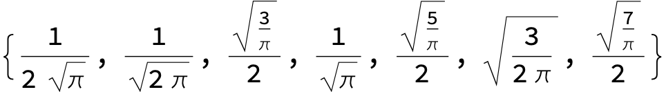

The values of rmax for increasing n integer values from 0 to 6;
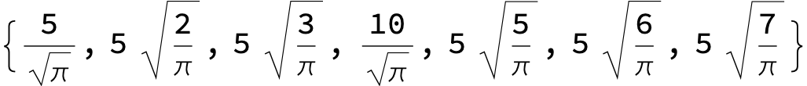

The values of $\theta(\xi)$;
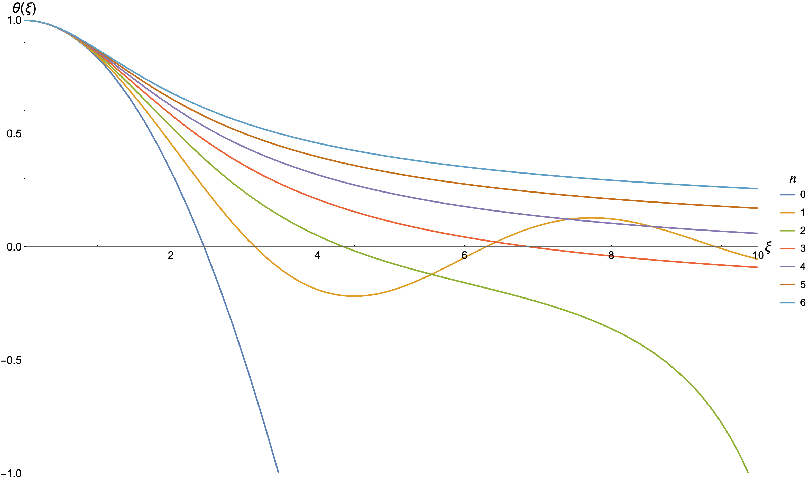

The values of $r(\xi)$;
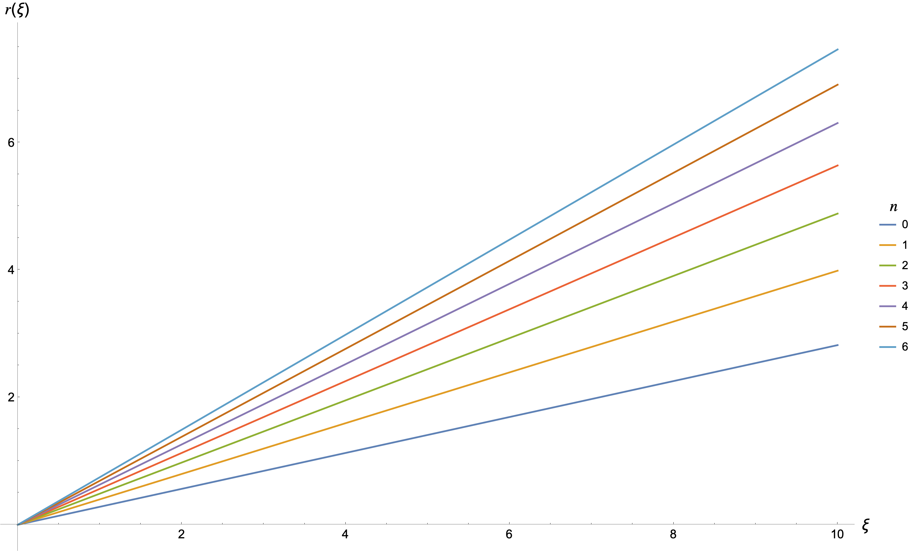

Now we shift to r-axis for understanding the further plots;
Note that you cannot achieve $M(\xi)$, so you have to shift back to physical radial coordinate. 

The values of $\rho(r)$;
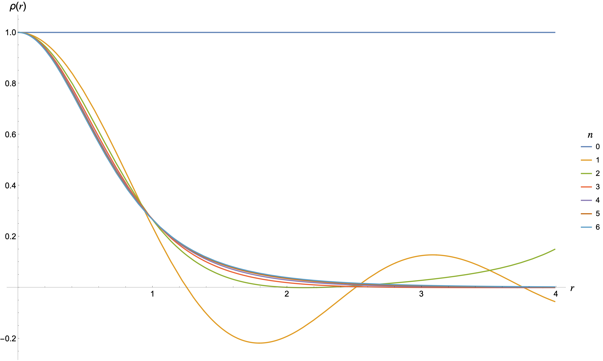

The values of $mass(r)$;
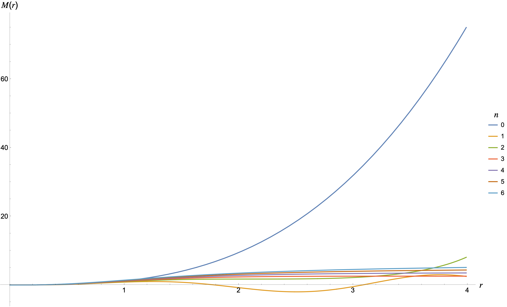

The values of $pressure(r)$;
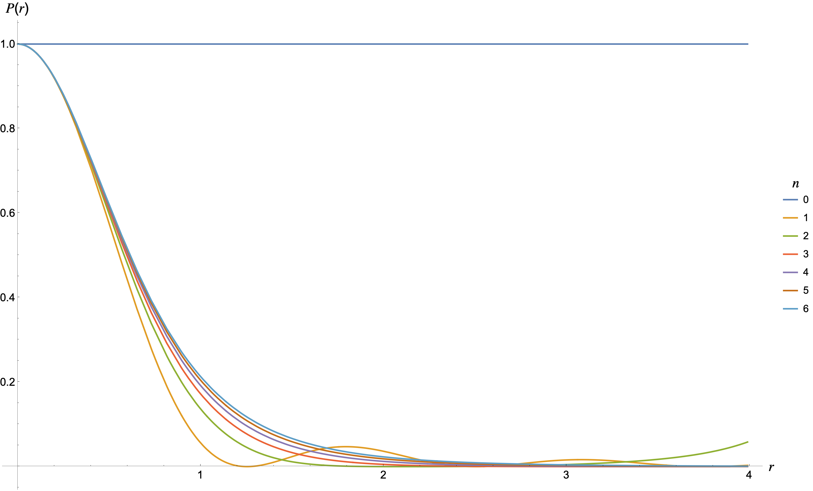

The values of $\frac{\partial P}{\partial r} (r)$;
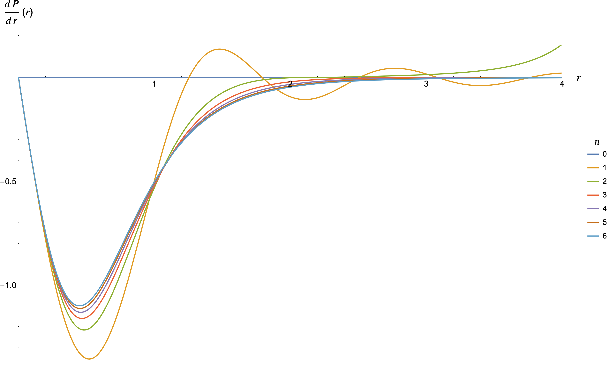

The values of $|\frac{\partial P}{\partial r} (r)|$;
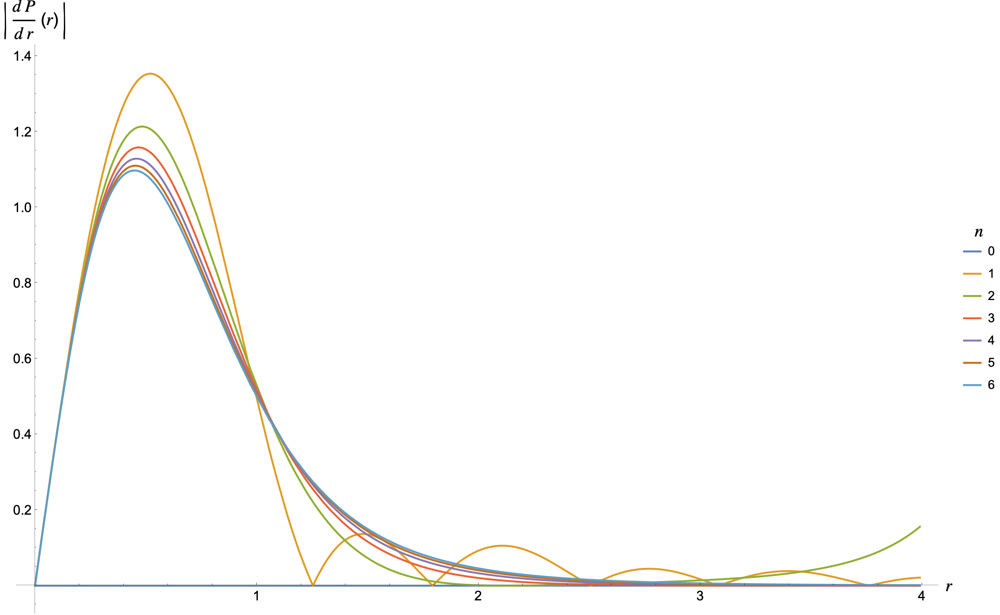

The values of $g(r)$;
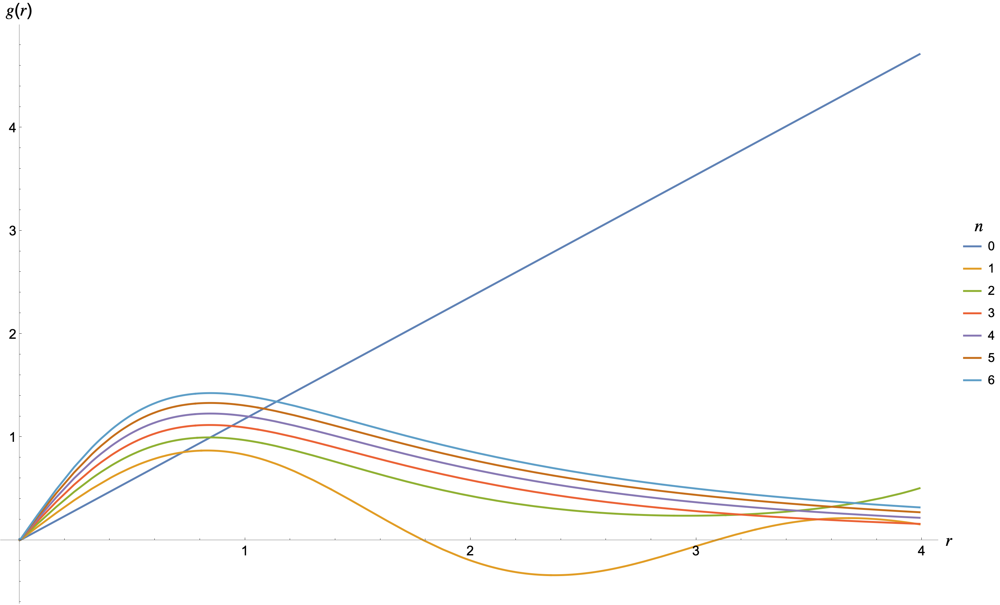

The values of $\rho(r) g(r)$;
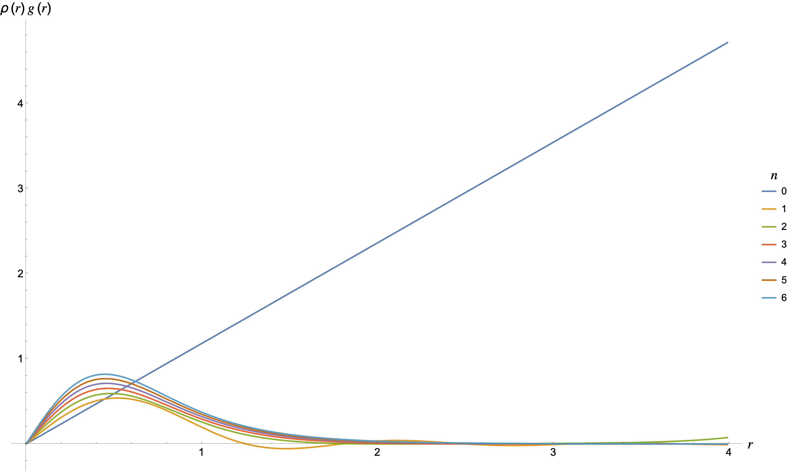

The values of $\frac{\frac{\partial P}{\partial r}}{\rho(r) g(r)}$;
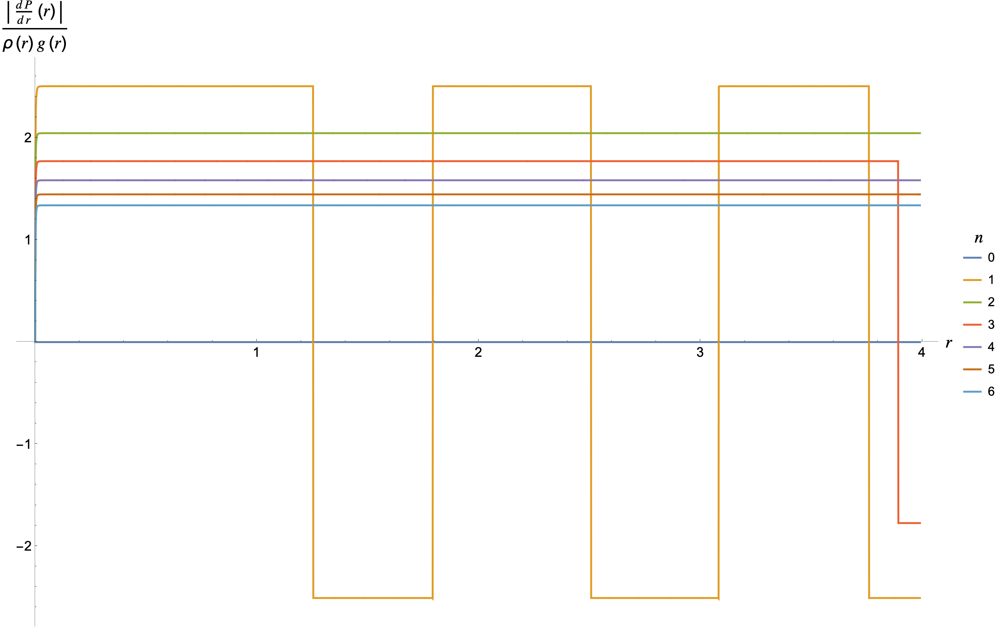

We _assumed_ hydrostatic equilibrium, which is essentially a competition between the forces due to pressure expansion and gravitational contraction. 
To compare these forces, we take their ratios and study that (just like we define reynold's number for comparing inertial and viscous forces for understanding turbulence in flow). 
We define $\beta(r) = \left|\frac{\frac{\partial P}{\partial r}}{\rho(r) g(r)}\right| + 1$. The $+ 1$ is considered for a specific reason, $\beta(r) = \rho(r) A(r)$ where $A$ is non-inertial acceleration of the frame. Thus, $\beta$ corresponds to the deviation parameter from the hydrostatic equilibrium where small $\beta$ means less deviation. 

The values of $\beta$;
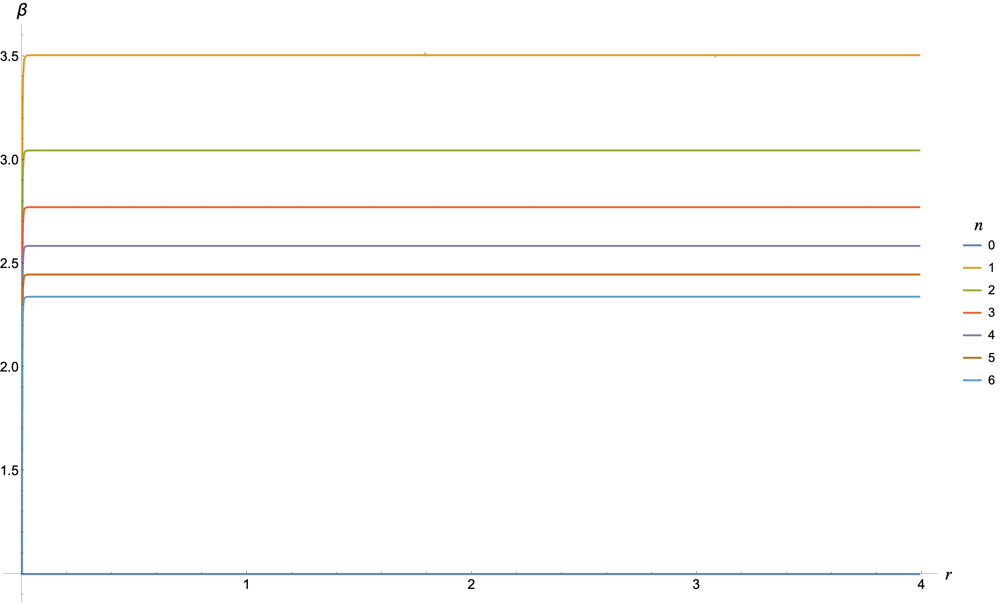

The temperature profile can be obtained from a simple ideal gas equation $P\mu = \rho k_{b} T$. 
The values of $temperature(r)$;
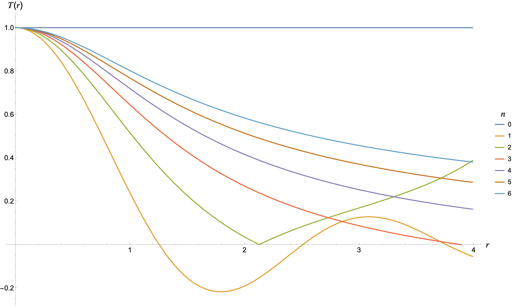

Now we connect the Lane Emden further to the Eddington Emden Chandrasekhar Equation which states that, 

For a spherically symmetric massive body, the gravitational flux $\Phi(r)$ passing through a shell (ring shaped) of thickness $\mathrm{d} r$ located at radial distance $r$ from the center of body (origin is at the center of body) is given by 

Note : This formula was found by human experience and logic, just how coulomb's law is defined. Therefore 

$\Phi( r + \mathrm{d}r ) - \Phi(r) \propto \rho(r)$

$\Phi( r + \mathrm{d}r ) - \Phi(r) \propto \Phi_{0}(r)$

$\Phi( r + \mathrm{d}r ) - \Phi(r) \propto \mathrm{d} r$

$\Phi( r + \mathrm{d}r ) - \Phi(r) = - C \rho(r) \Phi_{0}(r) \mathrm{d} r$ where $C$ is a constant of proportionality and $\Phi_{0}(r)$ is the incident flux at radial distance $r$. 

By stefan boltzmann law $\Phi(r) = \sigma T(r)^4$ where $\sigma$ is a stefan boltzmann constant and $T(r)$ is temperature profile of the body. 

$\Phi( r + \mathrm{d}r ) - \Phi(r) = 4 \sigma T^3 \mathrm{d} T$

Therefore, 
$\frac{\mathrm{d} T}{\mathrm{d} r} = -\frac{C \rho(r) \Phi_{0}(r)}{4 \sigma T^3}$ we can further substitute $\Phi(r) = \frac{L(r)}{4 \pi r^2}$ to obtain the luminosity relation. 

The values of $\Phi(r)$;
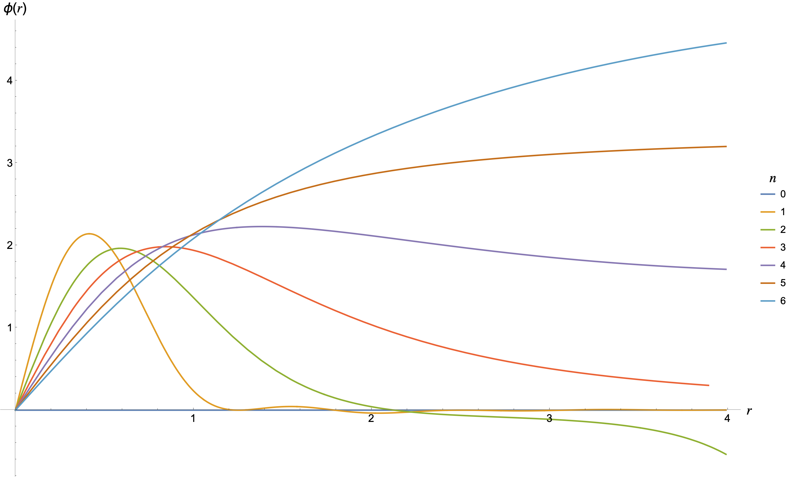

The values of $Luminosity(r)$;
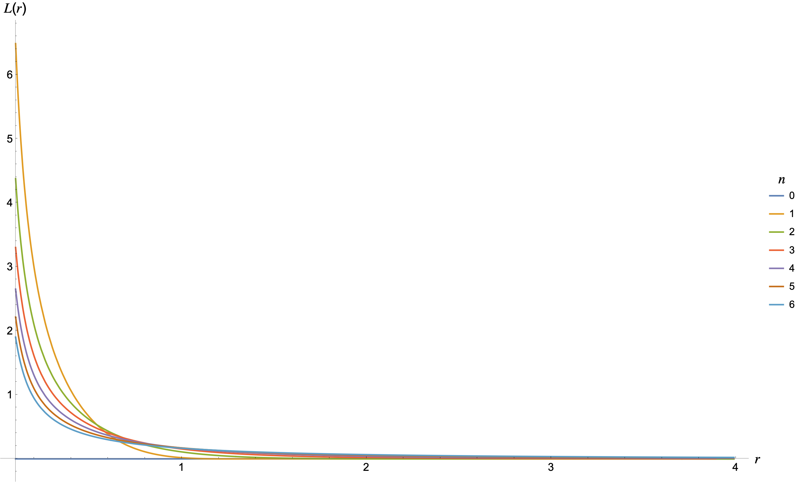

The essence of combining these equations is that **_for star containing ideal gas, which has spherical symmetry, we can now find for any thermodynamic process (polytropic index $n$), we can find the quantities_** $\rho(r), M(r), P(r), g(r), β, T(r), L(r)$ **_provided the central density_** $\rho_{c}$  **_,the polytropic constant_** $K$ **_,the flux constant_** $C$ **_, and the mean molecular weight_** $\mu$.
Knowing this, now its just fitting the observed information of stars to this equation's results in different $r$ regions. If we are lucky, there could be some star which is completely expressed by a single lane emden equation <!--(particular $n, \rho_{c}, K, C, \mu$ value). -->

The information of sun is given in below files. We want to fit this data using our knowledge. 


